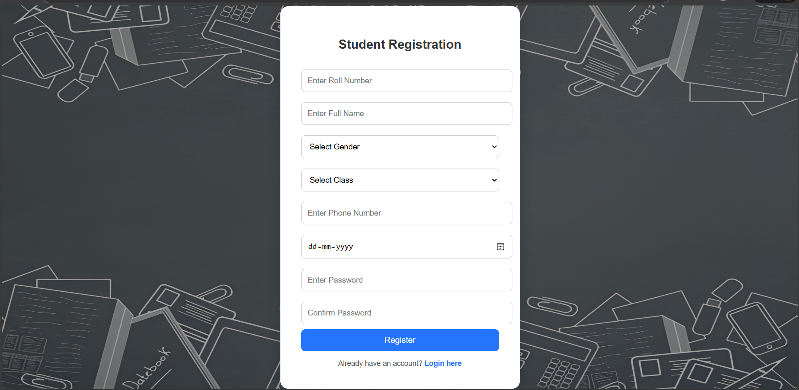
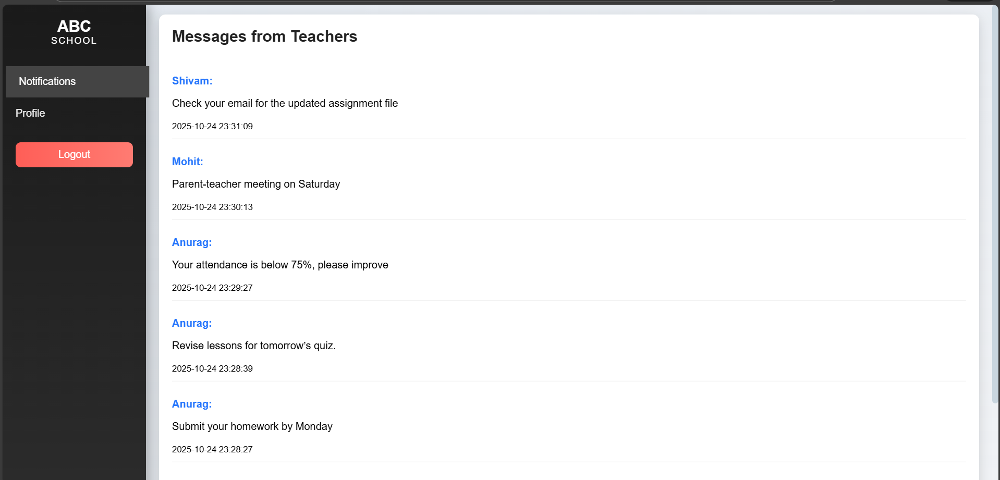
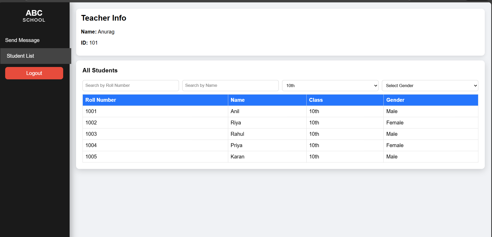
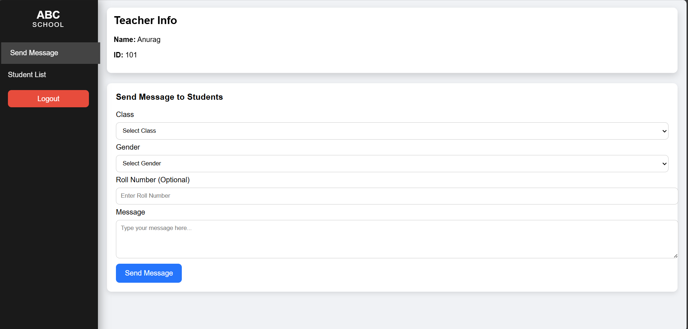

# E_Module_Task

This repository contains the code and resources for the **E_Module_Task** project.

## Project Screenshots
Here are some screenshots demonstrating the project:

  
  
  
  
  
  
  

## Installation
1. Clone the repository:
   ```bash
   git clone https://github.com/yadav09anil/E_Module_Task.git

